```mermaid
erDiagram
    %% Autenticação e Dashboard
    TelaLogin ||--o{ Dashboard : acessa
    TelaLogin {
        string email
        string senha
        button acessar
        link esqueceuSenha
    }

    Dashboard ||--o{ MenuLateral : contem
    Dashboard {
        logo vaccini
        string usuarioLogado
    }

    MenuLateral {
        item unidades
        item vacinas
        item planosSaude
        item agendamentos
        item pacientes
        item enfermeiras "admin"
        item gerentes "admin"
    }

    %% Gestão de Unidades
    MenuLateral ||--o{ GestaoUnidades : acessa
    GestaoUnidades ||--o{ ListaUnidades : exibe
    GestaoUnidades ||--o{ ModalUnidade : adiciona_edita

    ListaUnidades {
        string nome
        string endereco
        string faixaCEP
        string esquemas
        string planosSaude
        int vacinasAgendamento
        string acoes
    }

    ModalUnidade {
        string nomeUnidade
        string endereco
        string faixaCEP
        string cepsNaoAtendidos
        int qtdVacinasHorario
        array esquemas
        array planosSaude
        boolean naoAtendeApp
        boolean naoMostraPreco
    }

    %% Gestão de Vacinas
    MenuLateral ||--o{ GestaoVacinas : acessa
    GestaoVacinas ||--o{ ListaVacinas : exibe
    GestaoVacinas ||--o{ ModalVacina : adiciona_edita
    GestaoVacinas ||--o{ ProtecoesDoMes : gerencia

    ListaVacinas {
        string nome
        float precoAvulso
        float descontoPlano
        float valorPlano
        float descontoProtecao
        string protecaoMes
        string esquema
        string acoes
    }

    ModalVacina {
        string nomeVacina
        float precoBase
        float descontoPlano
        float precoPlano
        float descontoProtecao
        float precoProtecao
        string esquema
    }

    ProtecoesDoMes {
        string nome
        array vacinasIncluidas
        float valorTotal
    }

    %% Gestão de Planos de Saúde
    MenuLateral ||--o{ GestaoPlanosSaude : acessa
    GestaoPlanosSaude ||--o{ ListaPlanosSaude : exibe
    GestaoPlanosSaude ||--o{ FormularioPlanoSaude : adiciona_edita

    ListaPlanosSaude {
        string nomePlano
        float desconto
        string acoes
    }

    FormularioPlanoSaude {
        string nomePlano
        float desconto
    }

    %% Gestão de Agendamentos
    MenuLateral ||--o{ GestaoAgendamentos : acessa
    GestaoAgendamentos ||--o{ ListaAgendamentos : exibe
    GestaoAgendamentos ||--o{ FormularioAgendamento : adiciona_edita

    ListaAgendamentos {
        date intervaloData
        string status
        string unidade
        string paciente
        datetime horario
        string acoes
    }

    FormularioAgendamento {
        string paciente
        date data
        string horario
        string unidade
        string formaPagamento
    }

    %% Gestão de Pacientes
    MenuLateral ||--o{ GestaoPacientes : acessa
    GestaoPacientes ||--o{ ListaPacientes : exibe
    GestaoPacientes ||--o{ FormularioPaciente : adiciona_edita
    GestaoPacientes ||--o{ AgendamentosPaciente : visualiza

    ListaPacientes {
        string nome
        string cpf
        date dataNascimento
        string email
        string telefone
        string acoes
    }

    FormularioPaciente {
        string nome
        string cpf
        date dataNascimento
        string email
        string telefone
        string endereco
    }

    AgendamentosPaciente {
        array agendamentos
    }

    %% Gestão de Enfermeiras (Admin)
    MenuLateral ||--o{ GestaoEnfermeiras : acessa_admin
    GestaoEnfermeiras ||--o{ ListaEnfermeiras : exibe
    GestaoEnfermeiras ||--o{ ModalEnfermeira : adiciona_edita

    ListaEnfermeiras {
        string nome
        array unidadesAtribuidas
        string acoes
    }

    ModalEnfermeira {
        string nome
        array unidadesAtribuidas
    }

    %% Gestão de Gerentes (Admin)
    MenuLateral ||--o{ GestaoGerentes : acessa_admin
    GestaoGerentes ||--o{ ListaGerentes : exibe
    GestaoGerentes ||--o{ ModalGerente : adiciona_edita

    ListaGerentes {
        string nome
        array unidadesAtribuidas
        string acoes
    }

    ModalGerente {
        string nome
        array unidadesAtribuidas
    }
```

# Fluxo de Telas - Sistema Vaccini

## 1. Autenticação

### Tela de Login
- Campo de email
- Campo de senha
- Botão "Acessar conta"
- Link "Esqueceu a senha?"

## 2. Dashboard Principal

### Cabeçalho
- Logo Vaccini
- Menu de usuário (nome do usuário logado)

### Menu Lateral
- Unidades
- Vacinas
- Planos de Saúde
- Agendamentos
- Pacientes
- Enfermeiras (visível apenas para administradores)
- Gerentes (visível apenas para administradores)

## 3. Gestão de Unidades

### Lista de Unidades
- Tabela com colunas:
  - Nome
  - Endereço
  - Faixa de CEP
  - Esquemas
  - Planos de Saúde
  - Vacinas por Agendamento
  - Ações (Editar, Excluir)
- Botão "Adicionar Unidade"

### Modal de Adição/Edição de Unidade
- Campo: Nome da Unidade
- Campo: Endereço
- Campo: Faixa de CEP
- Campo: CEPs não atendidos
- Campo: Quantidade de vacinas por faixa de horário
- Seleção múltipla: Esquemas
- Seleção múltipla: Planos de Saúde
- Checkbox: Essa unidade não atende pelo aplicativo
- Checkbox: Essa unidade não mostra preço
- Botão: Salvar

## 4. Gestão de Vacinas

### Lista de Vacinas
- Tabela com colunas:
  - Nome
  - Preço avulso
  - Desconto no plano
  - Valor no plano
  - Desconto de proteção
  - Proteção do mês
  - Esquema
  - Ações (Editar, Excluir)
- Botão "Adicionar Vacina"
- Toggle para habilitar edição em massa

### Modal de Adição/Edição de Vacina
- Campo: Nome da Vacina
- Campo: Preço Base
- Campo: Desconto no Plano (%)
- Campo: Preço no Plano (calculado automaticamente)
- Campo: Desconto na Proteção (%)
- Campo: Preço na Proteção (calculado automaticamente)
- Campo: Esquema (separado por vírgulas)

### Proteções do Mês
- Lista de proteções criadas
- Formulário para criar nova proteção:
  - Campo: Nome da Proteção
  - Seleção múltipla: Vacinas incluídas
  - Exibição do valor total

## 5. Gestão de Planos de Saúde

### Lista de Planos de Saúde
- Tabela com colunas:
  - Nome do Plano
  - Desconto (%)
  - Ações (Editar, Excluir)
- Formulário para adicionar novo plano:
  - Campo: Nome do Plano
  - Campo: Desconto (%)

## 6. Gestão de Agendamentos

### Lista de Agendamentos
- Filtros:
  - Intervalo de datas
  - Status
  - Unidade
- Visualização em tabela:
  - Paciente
  - Data
  - Horário
  - Status
  - Unidade
  - Ações (Expandir detalhes, Editar, Excluir)
- Visualização em calendário
- Botão para imprimir agendamentos selecionados

### Formulário de Novo Agendamento
- Seleção de paciente
- Seleção de data
- Seleção de horário
- Seleção de unidade
- Seleção de forma de pagamento

## 7. Gestão de Pacientes

### Lista de Pacientes
- Tabela com colunas:
  - Nome
  - CPF
  - Data de Nascimento
  - Email
  - Telefone
  - Ações (Editar, Excluir)

### Formulário de Adição/Edição de Paciente
- Campo: Nome
- Campo: CPF
- Campo: Data de Nascimento
- Campo: Email
- Campo: Telefone
- Campo: Endereço

### Agendamentos do Paciente
- Lista de agendamentos vinculados ao paciente

## 8. Gestão de Enfermeiras (apenas para administradores)

### Lista de Enfermeiras
- Tabela com colunas:
  - Nome
  - Unidades Atribuídas
  - Ações (Editar, Excluir)
- Botão "Adicionar Enfermeira"

### Modal de Adição/Edição de Enfermeira
- Campo: Nome
- Seleção múltipla: Unidades atribuídas

## 9. Gestão de Gerentes (apenas para administradores)

### Lista de Gerentes
- Tabela com colunas:
  - Nome
  - Unidades Atribuídas
  - Ações (Editar, Excluir)
- Botão "Adicionar Gerente"

### Modal de Adição/Edição de Gerente
- Campo: Nome
- Seleção múltipla: Unidades atribuídas

