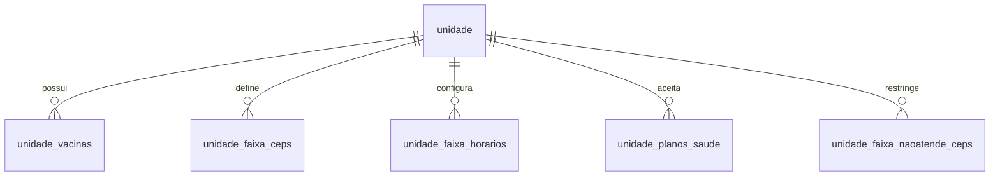
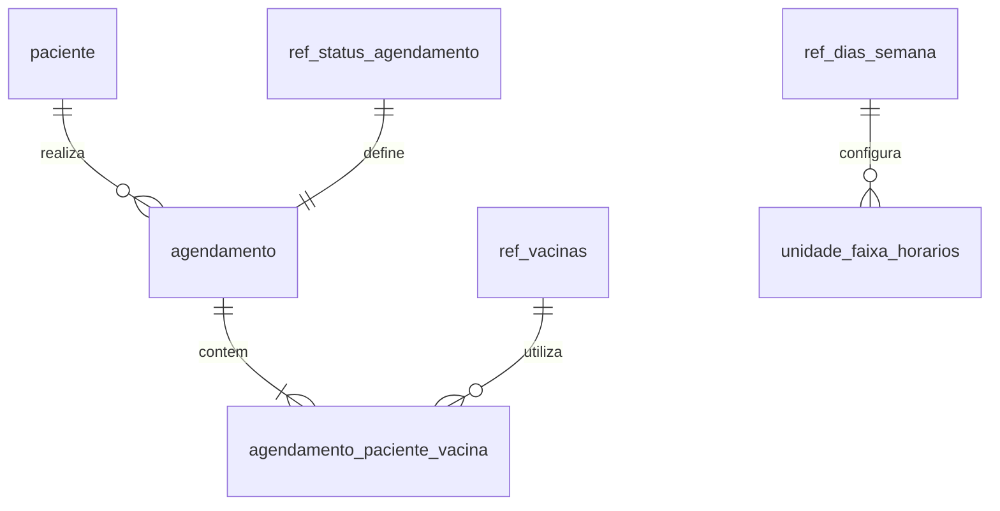
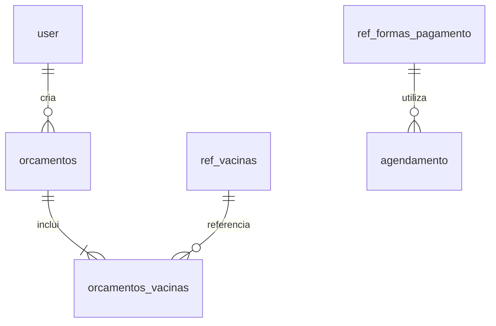
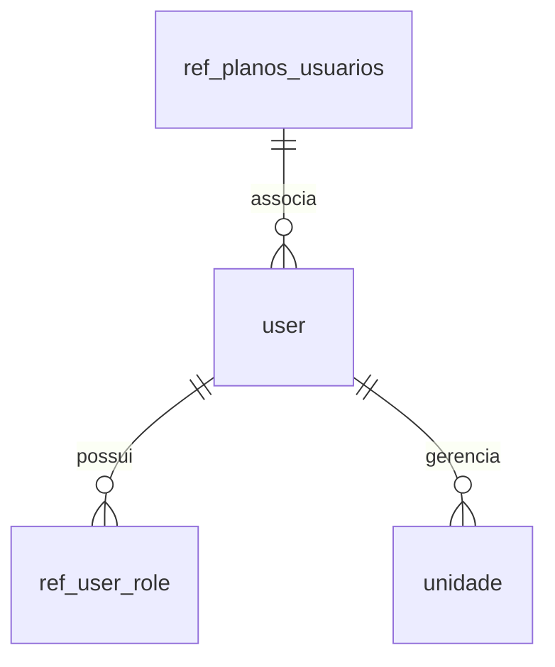

# Documentação de Arquitetura do Sistema Vaccini

## 1. Visão Geral do Sistema

### 1.1 Descrição do Projeto
O Vaccini é uma plataforma completa de gestão para clínicas de vacinação, desenvolvida para atender tanto unidades próprias quanto franqueadas. O sistema oferece um painel administrativo robusto que permite o gerenciamento eficiente de todos os aspectos operacionais de uma clínica de vacinação.

### 1.2 Objetivos do Sistema
- Centralizar a gestão de unidades de vacinação
- Automatizar processos de agendamento
- Controlar estoque e aplicação de vacinas
- Gerenciar equipes médicas e administrativas
- Fornecer relatórios e análises operacionais

### 1.3 Perfis de Acesso

#### Administrador
- Acesso total ao sistema
- Gerenciamento de unidades
- Cadastro de profissionais
- Configuração de vacinas e preços
- Gestão de planos e convênios
- Acesso a relatórios gerenciais
- Configuração de parâmetros do sistema

#### Enfermeira
- Acesso às unidades designadas
- Visualização de agendamentos
- Registro de aplicações
- Controle de estoque local
- Gestão da agenda

### 1.4 Funcionalidades Principais

#### Gestão de Unidades
- Cadastro e configuração de unidades
- Definição de áreas de atendimento por CEP
- Configuração de horários de funcionamento
- Gestão de equipes por unidade
- Controle de vacinas disponíveis

#### Gestão de Vacinas
- Cadastro de vacinas e valores
- Controle de estoque por unidade
- Esquemas de vacinação
- Configuração de doses e intervalos
- Preços diferenciados por unidade

#### Sistema de Agendamento
- Agendamento online e presencial
- Confirmação automática
- Lembretes por email/SMS
- Gestão de fila de espera
- Controle de horários disponíveis

### 1.6 Integrações
- Envio de comunicações
- Aplicativo mobile para pacientes
- APIs para parceiros
- Sistemas de gestão empresarial

---

## 2. Especificação do Projeto

### 2.1 Funcionalidades

- **Gerenciamento de Unidades:**
  - Criar, editar e desativar unidades.
  - Associar CEPs atendidos e horários de funcionamento.
- **Gestão de Usuários:**
  - Gerenciar perfis de administradores e enfermeiros.
  - Configurar permissões e associar usuários a unidades específicas.
- **Gestão de Vacinas:**
  - Cadastrar novas vacinas e configurar disponibilidade por unidade.
  - Definir preços e controlar estoque de cada unidade.
- **Agendamento de Vacinas:**
  - Configurar agendas de atendimento.
  - Criar agendamentos manuais ou via aplicativo.
  - Gerenciar horários e feriados.

### 2.2 Regras de Negócio

1. Cada unidade deve ter um CEP principal e faixas de CEPs atendidos.
2. Enfermeiras só podem acessar dados das unidades às quais estão associadas.
3. Vacinas só podem ser cadastradas em unidades ativas.
4. Agendamentos não podem ser criados em horários conflitantes.
5. Apenas administradores podem realizar alterações nos perfis de outros usuários.

### 2.3 Restrições

- O sistema deve garantir a integridade dos dados com validações em todos os formulários.
- As ações críticas, como exclusões, devem requerer confirmações adicionais.
- O acesso ao painel administrativo será restrito via autenticação multifator.

---

## 3. Padrões de Desenvolvimento

- **ESLint** para padronização de código.
- **Prettier** para formatação automática.
- **Conventional Commits** para mensagens de commit claras e padronizadas.
- **Git Flow** para organização de branches e fluxo de trabalho.

---

## 4. Considerações de Deploy

### 4.1 Ambiente de Produção

- **CI/CD**: Implementação via GitHub Actions.
- **Deploy**: Automatizado na Vercel.
- **Staging**: Ambiente de testes antes do deploy em produção.
- **Monitoramento**: Utilização de Sentry para rastreamento de erros.

### 4.2 Monitoramento

- Logs centralizados para auditoria.
- Métricas de performance para avaliação contínua.
- Alertas automáticos em caso de falhas críticas.
- Dashboards para visualização operacional.

---

## 5. Estrutura do Banco de Dados

### 5.1 Visão Geral das Tabelas

#### Tabelas Principais
1. `paciente`
2. `agendamento`
3. `esquema`
4. `orcamentos`
5. `unidade`
6. `user`

#### Tabelas de Referência
1. `ref_dias_semana`
2. `ref_planos`
3. `ref_status_agendamento`
4. `ref_vacinas`
5. `ref_formas_pagamento`
6. `ref_planos_saude`
7. `ref_user_role`
8. `ref_planos_usuarios`

#### Tabelas de Relacionamento
1. `unidade_faixa_ceps`
2. `unidade_faixa_horarios`
3. `unidade_faixa_naoatende_ceps`
4. `unidade_planos_saude`
5. `unidade_vacinas`
6. `agendamento_paciente_vacina`
7. `orcamentos_vacinas`

#### Views e Tabelas Auxiliares
1. `vacinas_detalhadas_unidade`
2. `vw_orcamento_vacina`
3. `unidade_ceps_naoatende`
4. `test`

### 5.2 Relacionamentos e Estrutura

#### 5.2.1 Módulo de Unidades e Localização

**Descrição dos Relacionamentos:**
- `unidade -> unidade_vacinas`: Uma unidade pode ter múltiplas vacinas disponíveis
- `unidade -> unidade_faixa_ceps`: Uma unidade define várias faixas de CEPs para atendimento
- `unidade -> unidade_faixa_horarios`: Uma unidade configura múltiplos horários de funcionamento
- `unidade -> unidade_planos_saude`: Uma unidade aceita diversos planos de saúde
- `unidade -> unidade_faixa_naoatende_ceps`: Uma unidade pode restringir CEPs específicos

#### 5.2.2 Módulo de Agendamentos e Pacientes

**Descrição dos Relacionamentos:**
- `paciente -> agendamento`: Um paciente pode ter múltiplos agendamentos
- `agendamento -> agendamento_paciente_vacina`: Um agendamento pode incluir várias vacinas
- `ref_vacinas -> agendamento_paciente_vacina`: Uma vacina pode estar em vários agendamentos
- `ref_status_agendamento -> agendamento`: Define o status atual do agendamento
- `ref_dias_semana -> unidade_faixa_horarios`: Define os dias de funcionamento da unidade

#### 5.2.3 Módulo de Orçamentos e Financeiro

**Descrição dos Relacionamentos:**
- `orcamentos -> orcamentos_vacinas`: Um orçamento contém múltiplas vacinas
- `ref_vacinas -> orcamentos_vacinas`: Uma vacina pode estar em vários orçamentos
- `user -> orcamentos`: Um usuário pode criar múltiplos orçamentos
- `ref_formas_pagamento -> agendamento`: Define a forma de pagamento do agendamento

#### 5.2.4 Módulo de Usuários e Permissões

**Descrição dos Relacionamentos:**
- `user -> ref_user_role`: Um usuário possui um ou mais papéis no sistema
- `user -> unidade`: Um usuário pode gerenciar múltiplas unidades
- `ref_planos_usuarios -> user`: Associação entre usuários e planos

### 5.2.5 Regras de Integridade

1. **Unidades e Vacinas**
   - Uma vacina só pode ser oferecida em unidades ativas
   - Preços podem variar por unidade
   - Horários de funcionamento devem ser válidos

2. **Agendamentos**
   - Não pode haver conflito de horários
   - Paciente deve estar cadastrado
   - Vacina deve estar disponível na unidade

3. **Usuários e Permissões**
   - Enfermeiras só acessam suas unidades designadas
   - Administradores têm acesso total ao sistema
   - Histórico de ações é mantido

4. **Orçamentos e Pagamentos**
   - Valores devem respeitar tabela da unidade
   - Desconto máximo permitido por perfil
   - Formas de pagamento conforme configuração

### 5.3 Detalhes das Tabelas Principais

#### Unidade
- Gerencia informações das unidades de vacinação
- Campos principais: id, nome, endereço, contato, status

#### Paciente
- Armazena dados dos pacientes
- Campos principais: id, nome, cpf, contato, endereço

#### Agendamento
- Controla agendamentos de vacinação
- Campos principais: id, data, paciente_id, unidade_id, status

#### User
- Gerencia usuários do sistema
- Campos principais: id, nome, email, perfil, status

### 5.4 Índices e Constraints

#### Chaves Primárias
- Todas as tabelas possuem `id` como PK
- Formato UUID para identificadores únicos

#### Foreign Keys
- agendamento -> paciente
- unidade_vacinas -> unidade, ref_vacinas
- agendamento_paciente_vacina -> agendamento, paciente, ref_vacinas

#### Índices
- CPF em paciente
- Email em user
- CEPs em unidade_faixa_ceps
- Datas em agendamento

### 6.5 Lista Completa de Tabelas

1. **Tabelas de Usuários e Autenticação**
   - `user`: Gerenciamento de usuários do sistema
   - `ref_user_role`: Definição de papéis e permissões
   - `test`: Tabela para testes do sistema

2. **Tabelas de Unidades**
   - `unidade`: Dados das unidades de vacinação
   - `unidade_faixa_ceps`: Faixas de CEPs atendidos
   - `unidade_faixa_horarios`: Horários de funcionamento
   - `unidade_faixa_naoatende_ceps`: CEPs não atendidos
   - `unidade_ceps_naoatende`: Registro de áreas não atendidas
   - `unidade_planos_saude`: Planos aceitos por unidade
   - `unidade_vacinas`: Vacinas disponíveis por unidade
   - `vacinas_detalhadas_unidade`: View com detalhes de vacinas por unidade

3. **Tabelas de Agendamento**
   - `agendamento`: Registro principal de agendamentos
   - `agendamento_paciente_vacina`: Relação entre agendamento, paciente e vacinas
   - `ref_status_agendamento`: Status possíveis do agendamento
   - `ref_dias_semana`: Dias da semana para agendamentos

4. **Tabelas de Pacientes**
   - `paciente`: Cadastro de pacientes

5. **Tabelas de Planos e Pagamentos**
   - `ref_planos`: Cadastro de planos
   - `ref_planos_saude`: Planos de saúde aceitos
   - `ref_planos_usuarios`: Relação entre planos e usuários
   - `ref_formas_pagamento`: Formas de pagamento aceitas

6. **Tabelas de Orçamentos**
   - `orcamentos`: Registro de orçamentos
   - `orcamentos_vacinas`: Detalhes de vacinas no orçamento
   - `vw_orcamento_vacina`: View de orçamentos

7. **Tabelas de Vacinas**
   - `ref_vacinas`: Cadastro base de vacinas
   - `esquema`: Esquemas de vacinação

Esta estrutura suporta:
- Gestão completa de unidades e suas áreas de atendimento
- Sistema de agendamento integrado
- Controle de vacinas e esquemas de vacinação
- Gestão de planos e pagamentos
- Sistema de orçamentos
- Controle de acesso e permissões
